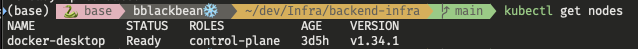

# kubernetes-basic
### Kubernetes 기초 학습 디렉토리
- Kubernetes가 왜 등장했는지 이해
- Pod, Deployment, Service 개념 이해
- Docker와 Kubernetes의 차이 이해
---

## 1. 왜 Kubernetes가 필요한가?
Docker는 컨테이너를 실행하는 도구
```bash
docker run nginx
```
- Docker는 컨테이너 실행은 잘하지만, 컨테이너가 많아지면 관리가 어려워진다.
- 예를 들어 Spring Boot, Redis, MySQL을 여러 대 서버에서 운영한다고 가정하면,
    - 컨테이너가 죽었는지
    - 몇 개가 실행 중인지
    - 다시 실행해야 하는지
    등을 직접 관리해야 한다. Kubernetes는 이러한 컨테이너 관리를 자동화하기 위해 등장했다.
---

## 2. Docker와 Kubernetes
### Docker
```text
Container
```
- Docker는 컨테이너를 실행한다.

### Kubernetes
```text
Pod
 └─ Container
```
- Kubernetes는 Pod를 실행한다.
---

## 3. Pod
Pod는 Kubernetes에서 가장 작은 실행 단위 (컨테이너를 담는 상자)
```text
Pod
 └─ FastAPI Container
```
```text
Pod
 └─ Spring Boot Container
```
- 대부분의 경우 Pod 1개, Container 1개 형태로 사용한다.
---

## 4. Deployment
Pod를 관리하는 객체(Pod 관리자)
```text
Deployment
 ↓
Pod 3개
```
Deployment는 다음 역할을 수행한다.
- Pod 생성
- Pod 개수 유지
- Pod 재생성
- 배포 관리
```text
Pod 1개 종료
 ↓
Deployment 감지
 ↓
새 Pod 생성
```
---

## 5. Kubernetes 구조
```text
Deployment
    ↓
Pod
    ↓
Container
```
Docker에서는 Container가 실행 단위였지만, Kubernetes에서는 Pod가 실행 단위이며, Deployment가 Pod를 관리한다.

### 정리
- Docker는 컨테이너를 실행한다.
- Kubernetes는 Pod를 실행한다.
- Pod는 컨테이너를 담는 실행 단위이다.
- Deployment는 Pod를 관리하는 관리자 역할을 한다.
- 실무에서는 Pod보다 Deployment를 더 자주 다룬다.
---

## 6. Service
- Service는 Pod의 고정 진입점 역할을 한다.
- Pod는 재생성되면 IP가 변경될 수 있다.
- Service는 사용자가 Pod의 IP를 직접 알지 않아도 되도록 대표 주소를 제공한다.
```text
사용자
    ↓
Service
    ↓
Pod
```
### Service의 역할
- 고정 주소 제공
- 로드밸런싱
- Pod 연결 관리

### 정리
- Pod IP는 변경될 수 있다.
- Service는 Pod 앞단의 대표 진입점이다.
- 사용자는 Service를 통해 애플리케이션에 접근한다.
---

## 7. Kubernetes YAML
Kubernetes에서 Pod, Deployment, Service 같은 리소스를 YAML 파일로 정의할 수 있다.

### Deployment
```yaml
apiVersion: apps/v1
kind: Deployment  # Deployment를 만든다.
metadata:
  name: nginx-deployment
spec:
  replicas: 2   # Pod 2개 유지
  selector:
    matchLabels:
      app: nginx
  template:
    metadata:
      labels:
        app: nginx
    spec:
      containers:
        - name: nginx
          image: nginx  # Pod 안에서 nginx 컨테이너를 실행하라는 뜻
          ports:
            - containerPort: 80
```
- `replicas: 2` : Pod 2개 유지
  ```
  Deployment
   ↓
  Pod 2개
   ↓
  nginx Container
  ```

### Service
Service는 Pod 앞단의 대표 진입점 역할을 한다.
```yaml
apiVersion: v1
kind: Service   # service 설정
metadata:
  name: nginx-service
spec:
  type: NodePort
  selector:
    app: nginx  # app: nginx 라벨을 가진 Pod를 찾아 연결
  ports:  # 외부 접근 포트 30080 -> Service 80 -> Pod 내부 80
    - port: 80
      targetPort: 80
      nodePort: 30080
```
- Service는 selector를 통해 연결할 Pod를 찾는다.
- 이 경우 app: nginx 라벨을 가진 Pod에 요청을 전달한다.
```
브라우저
 ↓
Service
 ↓
Pod
 ↓
Container
```
- Deployment는 Pod 개수를 유지하고, Service는 Pod로 요청을 전달한다.

### 실행 명령어
```bash
kubectl apply -f deployment.yaml
kubectl apply -f service.yaml
```

### 확인 명령어
```bash
kubectl get deployments
kubectl get pods
kubectl get services
```

### 삭제 명령어
```
kubectl delete -f service.yaml
kubectl delete -f deployment.yaml
```

### 정리
- Kubernetes 리소스는 YAML 파일로 정의할 수 있다.
- Deployment는 Pod를 생성하고 개수를 유지한다.
- Service는 Pod 앞단의 고정 진입점 역할을 한다.
- selector와 label을 통해 Service가 Pod를 찾는다.
---

## 8. Kubernetes 상태 확인 명령어
Kubernetes에서는 `kubectl get` 명령어로 리소스 상태를 확인할 수 있다.

### Node 확인

```bash
kubectl get nodes
```
```bash
NAME             STATUS   ROLES           AGE    VERSION
docker-desktop   Ready    control-plane   3d5h   v1.34.1
```
- STATUS가 Ready이면 로컬 Kubernetes 클러스터가 정상 동작 중이다.

### Deployment 확인
```bash
kubectl get deployments
```
```bash
NAME               READY   UP-TO-DATE   AVAILABLE   AGE
nginx-deployment   2/2     2            2           30s
```
- `READY 2/2` : 원하는 Pod 2개 중 2개가 정상 준비되었다.

### Pod 확인
```bash
kubectl get pods
```
```bash
NAME                                READY   STATUS    RESTARTS   AGE
nginx-deployment-7ccccd94f7-9zdp8   1/1     Running   0          3m8s
nginx-deployment-7ccccd94f7-p5dts   1/1     Running   0          3m8s
```
- `READY` : Pod 안의 컨테이너 준비 상태
- `STATUS` : Pod 실행 상태
- `RESTARTS` : 재시작 횟수 (RESTARTS가 계속 증가하면 애플리케이션이 반복적으로 죽고 다시 뜨는 상황일 수 있다.)

### Service 확인
```bash
kubectl get services
```
```bash
NAME            TYPE        CLUSTER-IP      EXTERNAL-IP   PORT(S)        AGE
kubernetes      ClusterIP   10.96.0.1       <none>        443/TCP        3d6h
nginx-service   NodePort    10.99.201.218   <none>        80:30080/TCP   6m15s
```
- `80:30080/TCP` : Service의 80번 포트가 외부 30080번포트와 연결됨

### 전체 리소스 확인
```bash
kubectl get all
```
```bash
NAME                                    READY   STATUS    RESTARTS   AGE
pod/nginx-deployment-7ccccd94f7-9zdp8   1/1     Running   0          7m13s
pod/nginx-deployment-7ccccd94f7-p5dts   1/1     Running   0          7m13s

NAME                    TYPE        CLUSTER-IP      EXTERNAL-IP   PORT(S)        AGE
service/kubernetes      ClusterIP   10.96.0.1       <none>        443/TCP        3d6h
service/nginx-service   NodePort    10.99.201.218   <none>        80:30080/TCP   6m56s

NAME                               READY   UP-TO-DATE   AVAILABLE   AGE
deployment.apps/nginx-deployment   2/2     2            2           7m13s

NAME                                          DESIRED   CURRENT   READY   AGE
replicaset.apps/nginx-deployment-7ccccd94f7   2         2         2       7m13s
```
- Pod, Service, Deployment, ReplicaSet 등을 한 번에 확인할 수 있다.

### 로그 확인
```bash
kubectl logs <pod-name>
```
- 실무에서는 애플리케이션 실행 오류, DB 연결 실패, 환경변수 문제 등을 확인할 때 사용한다.

### 삭제
```bash
kubectl delete -f service.yaml
kubectl delete -f deployment.yaml
```

### 정리
- Kubernetes에서는 `kubectl get`으로 리소스 상태를 확인한다.
- Deployment는 원하는 Pod 개수가 준비되었는지 확인한다.
- Pod는 STATUS, READY, RESTARTS를 중요하게 본다.
- Service는 Pod로 접근하기 위한 진입점과 포트 정보를 제공한다.
- `kubectl logs`는 컨테이너 로그를 확인하는 데 사용한다.